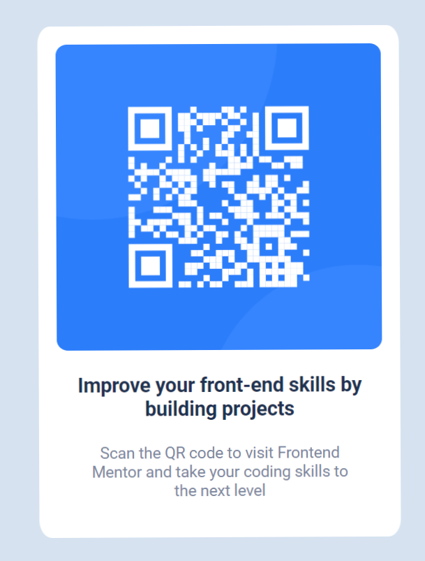

# Frontend Mentor - QR code component solution

This is a solution to the [QR code component challenge on Frontend Mentor](https://www.frontendmentor.io/challenges/qr-code-component-iux_sIO_H). Frontend Mentor challenges help you improve your coding skills by building realistic projects. 

## Table of contents

- [Overview](#overview)
  - [Screenshot](#screenshot)
  - [Links](#links)
- [My process](#my-process)
  - [Built with](#built-with)
  - [What I learned](#what-i-learned)
- [Author](#author)

## Overview

### Screenshot

### Links

- Solution URL: [https://github.com/BrionesDev/BrionesDev.github.io](https://github.com/BrionesDev/BrionesDev.github.io)
- Live Site URL: [https://brionesdev.github.io/](https://brionesdev.github.io/)

## My process

### Built with

- Semantic HTML5 markup
- CSS custom properties
- Flexbox
- CSS Grid

### What I learned

As a first challenge, I was able to improve my layout skills remembering some useful tools like **Flexbox** and **Grid**. 📐
I also used **var()** in CSS which is really powerful for big projects and have a good way to customize your site easily. 🔥
I finally kept in mind to had **favicon** in **<head>** tag, it should be always set in our projects. ⭐

## Author

- Frontend Mentor - [@BrionesDev](https://www.frontendmentor.io/profile/BrionesDev)
